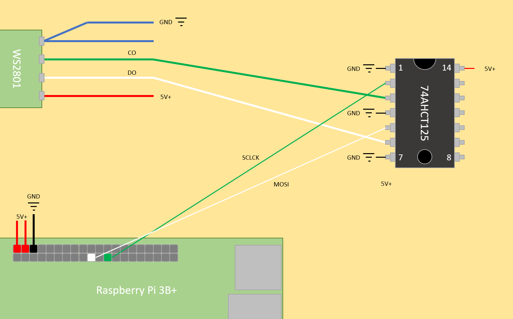

# wallpretty
WS2801 project, creating a mountable, interactive, LED... thinger

## Background
There are plenty of ways to build something like this.
I used a RaspberryPi 3B+ on Raspbian Buster.
Python 3.8+ is recommended because of the Flask-based websocket stack.
Other webservers will work fine, but I chose Flask + Flask-Sock because of how simply it allows websockets.
There are no .js includes on the HTML side, so that piece of the communications is easy to parse by a human.
Learning more about websockets was a side goal for this project.

## Important Files
- test.py: Runs WS2801 grid demo
- websocket-quart.py: Flask-based HTTP/websocket control for the grid
- templates/index.html: Base HTML doc for Flask to render and send to client browsers
- ws2801_funcs.py: Carries some of the WS2801 functions
- Dockerfile: Attempt to make this Docker-able.  WIP.  GPIO is hard.  (-:

## Parts List
- [RaspberryPi with breadboard, power supply, MicroSD card, etc](https://www.amazon.com/gp/product/B07BC567TW); demo build is a 3B+
- [WS2801 LED strings](https://www.amazon.com/gp/product/B0192VUDNG); demo build has 4 strings, 200 lights total
- [3 to 5V logic stepper](https://www.amazon.com/gp/product/B00XW2L39K); strictly speaking, this isn't required, but you may less flicker with this included
- [Wires that plug into breadboards easily](https://www.amazon.com/gp/product/B01EV70C78)
- [T-connectors](https://www.amazon.com/gp/product/B07114RK67); they make powering the strings in parallel much easier
- Lexan or Plexi or cardboard or whatever you'd like to mount on!

## Wiring

There are wire coloring assumptions that may not hold true!  Please check specs of your materials before going ahead.  
Central to all of this are 5V+ and GND, of course.
With a breadboard adapter connecting the Pi, I used the 5V+/- rails on the edge for all power and ground.
I tried adding an external 5V power source to these rails and removed the MicroUSB power, but the Pi wouldn't power up consistently.
NB: while power can be transmitted all the way down the chain, there will be noticeable dimming.
The T-connectors make parallel power pretty easy.  
For signal, the WS2801 string needs `CO` connected to `SCLCK` on the Pi, and `DO` connected to `MOSI`.
They can be connected directly with some success, but the stepper has improved results for me.

## Tools List
- Multimeter to check connections and voltage
- [6mm drill bit for through-mounting LEDs](https://www.amazon.com/gp/product/B0751893Y2)
- [Knife for cutting Lexan/Plexi/etc](https://smwwwile.amazon.com/gp/product/B000C027ZE)
